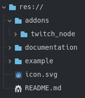
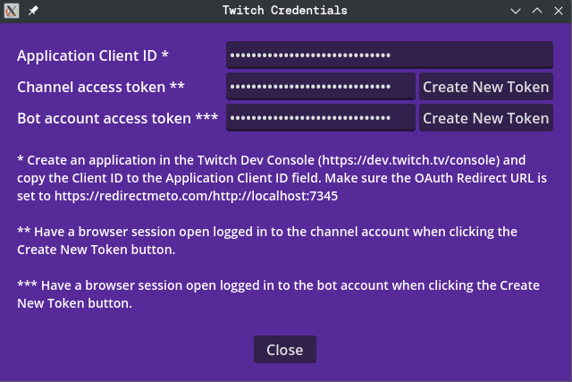
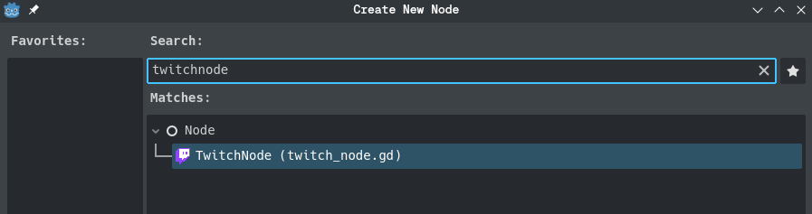

# TwitchNode
TwitchNode is a Godot library for easy interfacing with Twitch from GDScript. It can be used for developing Twitch integrated games, chatbots, chat applications or stream overlays.

## Features
- Provides GDScript signals for incoming chat messages, bits, channel info updates, followers, subs, hype trains, raids, polls, predictions, channel points redemptions and vip changes.
- Provides GDScript functions for sending chat messages, updating channel info, sending shoutouts, creating polls, creating and updating predictions, warning/banning users, adding vips, creating rewards, sending announcements, starting raids, getting subs, followers and vips info
- Track channel events with a channel access token and send chat messages with a bot account access token
- Supports the use of user display names as input parameters (automatic translation to userids)
- Auth window scene that can be (partly) reused in your own project, for easily generating new access tokens using the Implicit grant flow. Launches a local http server to capture the token after redirect, so no copy-pasting needed by the user.
- No unencrypted tokens in variables. This makes the addon safe for streaming while developing and debugging
- Encrypted storage of client id and tokens in the project user directory
- Built in rate limiting to prevent you from getting into trouble when accidentally launching too many requests

No support (yet) for:
- Connecting to multiple channels at the same time
- OAuth grant flows other than the Implicit grant flow

## Install
Clone the project or download the zip file. Copy the files and folders to your project folder. Make sure they are in the root directory of your project.

## Getting started
The easiest way to get started is to use the provided auth window scene:

1) Register a new application in the [Twitch Dev Console](https://dev.twitch.tv/console). If you want to use the TwitchNode auth scene, make sure you set the OAuth Redirect URL to https://redirectmeto.com/http://localhost:7345
2) Run the auth window scene (`addons/twitch_node/auth_window/twitch_auth_window.tscn`)

3) Copy the client id of your application from the Twitch Dev Console to the `Application Client ID` field
4) Make sure you have a browser session open logged into your channel account and click the `Create New Token` button next to `Channel access token`. A browser tab will open, showing you info about the scope of the token. Click `Authorize`.
5) Make sure you have a browser session open logged into the bot account and click the `Create New Token` button next to `Bot account access token`. A browser tab will open, showing you info about the scope of the token. Click `Authorize`.

The tokens are automatically picked up by the addon and saved in an encrypted file called twitch_credentials in the user directory of the project, they will automatically be retrieved when a TwitchNode is initialized. You can reuse (parts of) the auth window in your own programs to allow users to easily generate access tokens.
You can now start using the Twitch API services by adding a TwitchNode node to your scene and calling the connect_to_channel function.

Alternatively, instead of using the auth window scene, you can call the set_credentials functions of TwitchNode to set the client id, and the channel and user access tokens. If the store parameter is set to true, it will save the credentials in an encrypted file in the project user directory and the credentials will automatically be retrieved on future executions.

Access tokens expire after around 50 days, so you'll have to create new tokens after that.

## Use
You can use this addon by adding a TwitchNode node to your scene. Make sure you only have one active TwitchNode in your program at any time, to prevent unexpected behaviour.
To start listening for channel events, call the connect_to_channel function of the TwitchNode. You can connect to the signals of the TwitchNode to get called when events happen like new chat messages, new followers etc. Use the functions of the TwitchNode to perform actions like sending messages, starting polls etc. The channelname passed in input should be the channel for which an access token has been created.

See the twitch_example scene in the example folder for an example of how to use the TwitchNode functions. To run this example, fill in the variables `channel name` and `bot account name` in the inspector with the account names for which tokens have been generated.

## License
This project is released under the MIT license by MathrimC (2024)
