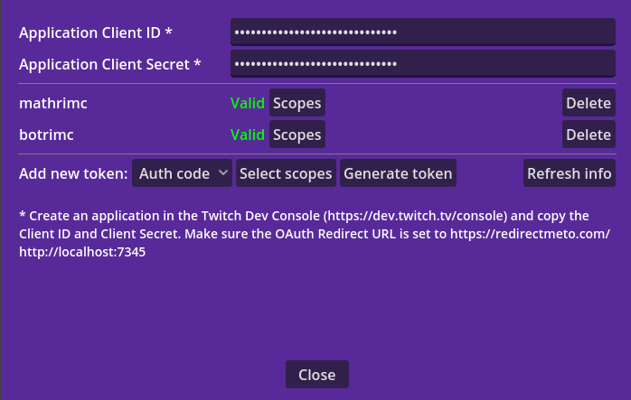

# TwitchNode
TwitchNode is a Godot library for easy interfacing with Twitch from GDScript. It can be used for developing Twitch integrated games, chatbots, chat applications or stream overlays.

## Features
- Provides GDScript signals for incoming chat messages, bits, channel info updates, followers, subs, hype trains, raids, polls, predictions, channel points redemptions, vip changes and ads.
- Provides GDScript functions for sending chat messages, updating channel info, sending shoutouts, creating polls, creating and updating predictions, warning/banning users, adding vips, creating rewards, sending announcements, starting raids, getting subs, followers and vips info, getting ad info, and starting and snoozing ads
- Supports the use of user display names and login names as input parameters (automatic translation to userids)
- Supports the use of multiple accounts and tokens simultaniously (e.g. a channel account token to follow evenst like followers and subs, while using a bot account token to post messages)
- Auth window scene that can be (partly) reused in your own project, for easy generation of new access tokens using the Implicit grant flow or the Authentication Code grant flow. Launches a local http server to capture the token after redirect, so no copy-pasting needed by the user
- No unencrypted tokens in variables (except at the moment of redirect capture). This makes the addon safe for streaming while developing and debugging
- Encrypted storage of client id and tokens in the application user directory
- Built in rate limiting to prevent you from getting into trouble when accidentally launching too many requests

## Release notes
25/02/2024: Breaking changes due to authentication refactoring:

- Access tokens need to be regenerated
- The following functions require an additional input parameter to indicate which account needs to be used for authentication: send_shoutout, warn_user, ban_user, get_follower_info, get_followers, get_next_followers, is_moderator, get_moderators, get_next_moderators
- The function set_credentials no longer takes channel token and user token in input. To modify tokens, use the new functions add_token and delete_token

## Install
Clone the project or download the zip file. Copy the files and folders to your project folder. Make sure they are in the root directory of your project.

## Getting started
The easiest way to get started is to use the provided auth window scene:

1) Register a new application in the [Twitch Dev Console](https://dev.twitch.tv/console). If you want to use the TwitchNode auth scene, make sure you set the OAuth Redirect URL to https://redirectmeto.com/http://localhost:7345
2) Run the auth window scene (`addons/twitch_node/auth_window/twitch_auth_window.tscn`)

3) Copy the client id of your application from the Twitch Dev Console to the `Application Client ID` field
4) Next to `Add new token`, select the authentication grant type.
    - Use `Auth Code` when the application will only run on your computers or servers. When you select this option, an input field `Application Client Secret` will appear. Fill this in with the `Client Secret` you can create in the application settings in the Twitch developer console.
    - Use `Implicit` when the application will also run on the device of other users.
5) Select the scopes you want for the access token. This determines which notifications you can get and which operations you can do with the token. For security reasons, it is recommended to only select the scopes for the functionalities you actually need.
6) Click the `Generate New Token` button. A browser tab will open, showing you info about the scope of the token. Click `Authorize`.

The token is automatically picked up and saved in an encrypted file called `twitch_credentials` in the user directory of the project. These credentials will automatically be retrieved on startup of you application. You can reuse (parts of) the auth window in your own application to allow users to easily generate access tokens.
You can now start using the Twitch API services by adding a `TwitchNode` node to your project. To get event notifications for a channel, call the `connect_to_channel` function with the channel name and the authenticated account name in input.

Alternatively, instead of using the auth window scene, you can call the `set_credentials` functions of TwitchNode to set the client id and client secret. If the `store` parameter is set to true, it will save the credentials in an encrypted file in the project user directory and the credentials will automatically be retrieved on future executions. Use the add_token and delete_token functions to add or remove access tokens.

Access tokens generated with the `Implicit` grant flow expire after around 50 days, so you'll have to create new tokens after that.

## Use
You can use this addon by adding a `TwitchNode` node to your scene. Make sure you only have one active TwitchNode in your program at any time, to prevent unexpected behaviour.
To start listening for channel events, call the `connect_to_channel` function of the TwitchNode. You can connect to the signals of the TwitchNode to get called when events happen like new chat messages, new followers etc. Use the functions of the TwitchNode to perform actions like sending messages, starting polls etc.

See the `twitch_example` scene in the example folder for an example of how to use the TwitchNode functions.

## License
This project is released under the MIT license by MathrimC (2024)
